# PriorityForge System Architecture Diagram

## System Architecture Overview

```mermaid
graph TB
    subgraph "Client Layer"
        User[👤 User]
        Browser[🌐 Web Browser]
    end

    subgraph "Frontend - React (Vite)"
        UI[React Components]
        State[State Management]
        API_Client[API Client<br/>Axios/Fetch]
    end

    subgraph "Backend - FastAPI"
        subgraph "API Layer"
            Routes_Task[📝 Task CRUD Routes<br/>GET/POST/PUT/DELETE /api/tasks]
            Routes_Analytics[📊 Analytics Routes<br/>GET /api/analytics]
            Routes_Recommend[🤖 Recommendation Routes<br/>POST /api/recommend]
            Routes_Visualize[📈 Visualization Routes<br/>GET /api/visualize/pq]
        end
        
        subgraph "Service Layer"
            TaskService[Task Service<br/>Business Logic]
            AnalyticsService[Analytics Service<br/>Data Analysis]
            RecommendService[Recommendation Service<br/>ML Recommendations]
            VisualizeService[Visualization Service<br/>PQ State Processing]
        end

        subgraph "Priority Queue Engine"
            PQEngine[PriorityQueueEngine<br/>Core Engine]
            PQAlgorithms[Priority Algorithms<br/>Default, Eisenhower, TimeDecay]
        end
    end

    subgraph "Data Layer"
        SQLite[(SQLite Database)]
        SQLAlchemy[SQLAlchemy ORM]
        Models[Data Models<br/>Task, Base]
    end

    subgraph "Future Extensions"
        ML_Module[ML Module<br/>Future]
        Analytics_DB[Analytics Database<br/>Future]
    end

    %% User to Frontend
    User --> Browser
    Browser --> UI

    %% Frontend Internal Flow
    UI --> State
    State --> API_Client

    %% Frontend to Backend API Routes
    API_Client -->|HTTP Requests| Routes_Task
    API_Client -->|HTTP Requests| Routes_Analytics
    API_Client -->|HTTP Requests| Routes_Recommend
    API_Client -->|HTTP Requests| Routes_Visualize

    %% API Routes to Services
    Routes_Task --> TaskService
    Routes_Analytics --> AnalyticsService
    Routes_Recommend --> RecommendService
    Routes_Visualize --> VisualizeService

    %% Services to Priority Queue Engine
    TaskService --> PQEngine
    AnalyticsService --> PQEngine
    RecommendService --> PQEngine
    VisualizeService --> PQEngine
    PQEngine --> PQAlgorithms

    %% Services to Database
    TaskService --> SQLAlchemy
    AnalyticsService --> SQLAlchemy
    RecommendService --> SQLAlchemy
    VisualizeService --> SQLAlchemy
    SQLAlchemy --> Models
    Models --> SQLite

    %% Priority Queue Engine to Database (for reading/writing task state)
    PQEngine <--> SQLAlchemy

    %% Future Extensions
    RecommendService -.->|Future| ML_Module
    AnalyticsService -.->|Future| Analytics_DB
    ML_Module -.->|Future| Analytics_DB

    %% Response Flow (dashed lines)
    SQLite -.->|Query Results| SQLAlchemy
    SQLAlchemy -.->|Models| TaskService
    PQEngine -.->|Priority Scores| TaskService
    TaskService -.->|JSON Response| Routes_Task
    Routes_Task -.->|HTTP Response| API_Client
    API_Client -.->|Update State| State
    State -.->|Re-render| UI
    UI -.->|Display| Browser

    %% Styling
    classDef frontend fill:#61dafb,stroke:#20232a,stroke-width:2px,color:#000
    classDef backend fill:#009485,stroke:#fff,stroke-width:2px,color:#fff
    classDef database fill:#003b57,stroke:#fff,stroke-width:2px,color:#fff
    classDef engine fill:#ff6b6b,stroke:#fff,stroke-width:2px,color:#fff
    classDef future fill:#ccc,stroke:#666,stroke-width:2px,color:#000,stroke-dasharray: 5 5

    class UI,State,API_Client,Browser frontend
    class Routes_Task,Routes_Analytics,Routes_Recommend,Routes_Visualize,TaskService,AnalyticsService,RecommendService,VisualizeService backend
    class SQLite,SQLAlchemy,Models database
    class PQEngine,PQAlgorithms engine
    class ML_Module,Analytics_DB future
```

## Detailed Component Flow Diagram

## Priority Queue Engine Internal Architecture

## Data Flow Diagram

## Technology Stack Diagram

